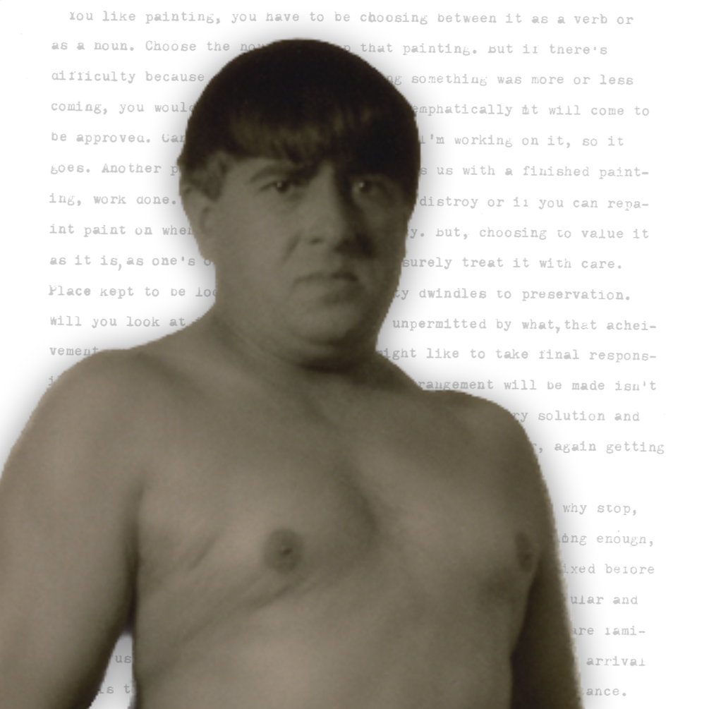

# Picabia

> ne sommes-nous pas trahis par l'importance

I wrote this text in 1980 as my BA thesis - Chelsea School of Art - I remember I got so infuriated at some point when trying to produce enough words that I kicked the rubbish bin across the room and broke it - it was an old light blue plastic thing - but joao wondered that I could get so worked up about having to write some dumb essay
when I handed it in - the title was look at askance by those guys in the Art History dept

at that time picabia was just emerging as a source for new spirit in painting people like David Salle - there had been a big show at the Pompidou - the catalogue made it all seem interesting and fresh

I wouldn't change much - I still think what I thought then - twenty five years ago - that's an odd feeling - because a lot has changed
